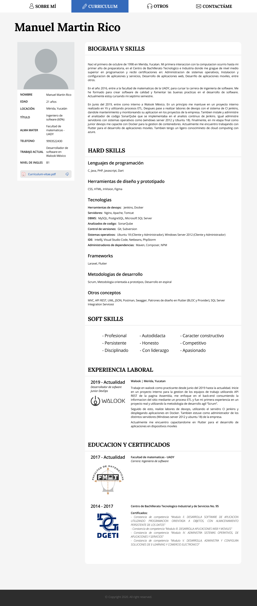
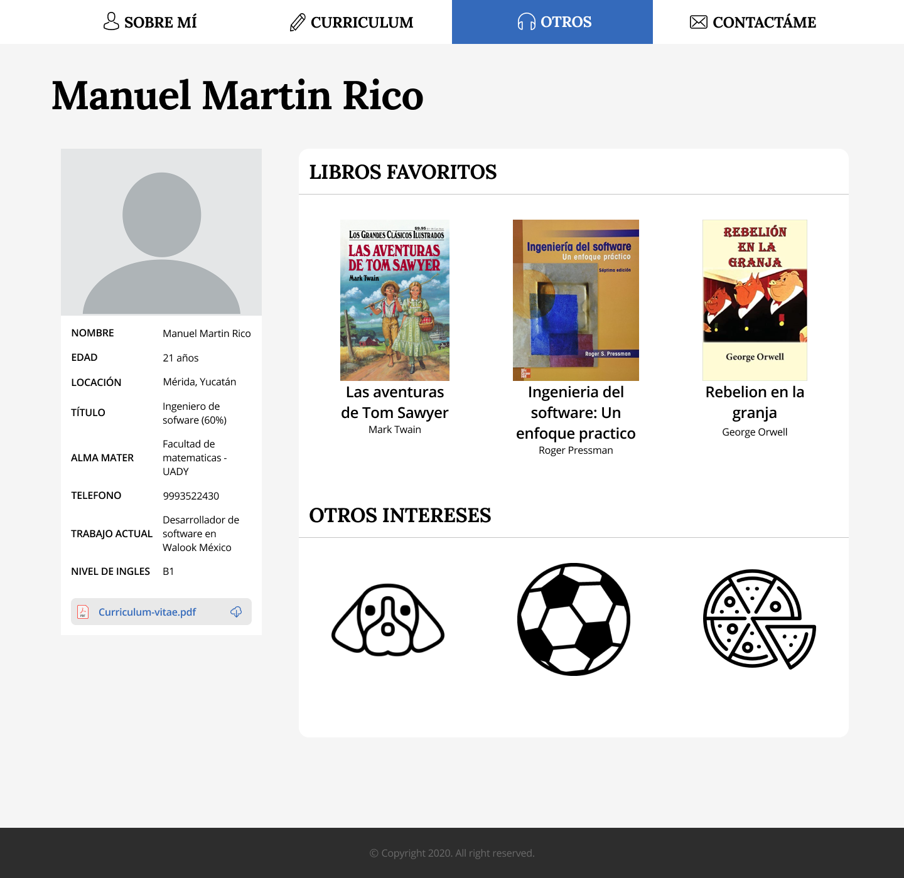
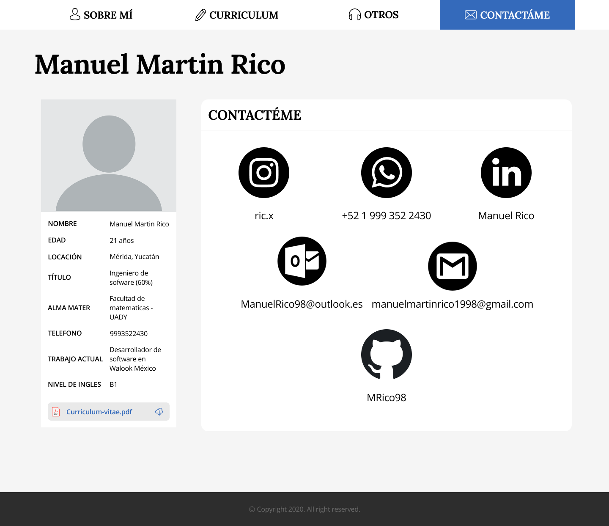

# Web CV
Este es mi curriculum vitae, contiene la informacion mas importante de mi formacion profesional

## Secciones
<ol>
  <li>Sobre mí</li> 
  
  ```
Cuento, en resumen, quien soy, informacion personal y cuales son los servicios en los que estoy 
capacitado
  ```
  
  
  
  <li>Curriculum</li>
  
  ```
Muestro mi con un resumen de mi biografia, mis diferentes skills y mi formacion estudiantil, 
asi como mi experiencia laboral
  ```
  
  
  
  <li>Otros</li>  
  
  ```
En este seccion se muestran otros gustos e intereses que tengo
  ```
  
  
  
  <li>Contactame</li>
  
  ```
Mis distintas redes y maneras de contectarme
  ```
  
  
  
</ol>
  
  Cada pantalla fue creada utilizando **Figma**
  
  [Link del prototipado en Figma](https://www.figma.com/file/ROSbFT5TTUjm9kruMjQqzP/Curriculum?node-id=0%3A1)
